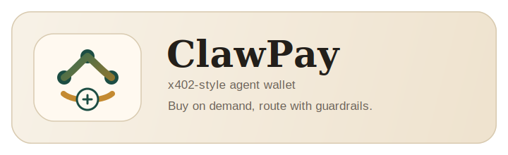

<p align="center">
  
</p>

# ClawPay

**A small x402-style agent wallet demo for buying APIs on demand with policy guardrails.**

<p>
  
  
  
  
  
</p>

## Why this matters

Today's API economy is built for humans:

- sign up first
- store a card first
- get an API key first
- hardcode the provider first

That breaks agentic workflows.

ClawPay flips that model from **contract-first** to **buy-at-request-time**:

- the agent receives a task
- it discovers candidate paid APIs
- compares price and fit
- checks policy
- pays only if allowed
- executes and logs the spend

This repo is a working prototype of that flow.

## Overview

- **Dynamic API selection:** the router compares multiple paid providers and picks the cheapest compatible one for the task.
- **Request-time purchase flow:** the demo includes both local and external seller paths, both using an x402-style `402 -> pay -> retry` pattern.
- **Policy controls:** child-wallet-only spend, daily caps, session caps, approval thresholds, loop protection, and top-up controls are implemented.
- **Auditability:** paid, blocked, approval-required, and wallet events are persisted locally.

## Current Scope

In its current form, ClawPay shows that an AI agent can:

1. choose between multiple paid APIs without pre-registration
2. compare price before purchase
3. buy from separated seller surfaces on demand
4. spend only from a child wallet allocated by a parent wallet
5. stop automatically when policy says no

## Core Flow

```text
Task
  -> candidate providers discovered
  -> cheapest compatible provider selected
  -> seller returns HTTP 402-style payment requirement
  -> policy engine checks allowlist / per-call / session / daily / loop / approval rules
  -> child wallet authorizes payment
  -> request is retried
  -> result + spend log + wallet state are returned
```

## Design Notes

The more interesting part of the demo is not only that payment works, but that payment is surrounded by decision-making and limits.

ClawPay is built around a simple question:

> How do you let agents buy tools autonomously without letting them spend autonomously without limits?

So the project combines:

- **tool routing**
- **price-aware provider selection**
- **x402-style payment**
- **wallet hierarchy**
- **policy enforcement**
- **local audit trail**

into one end-to-end flow.

## Safety Controls

| Control | What it does |
|---|---|
| `allowlist` | Limits which providers the agent may use |
| `maxPerCallUsd` | Blocks unexpectedly expensive single calls |
| `maxPerSessionUsd` | Prevents a session from overspending |
| `maxPerDayUsd` | Enforces a daily spend ceiling |
| `approvalRequiredAboveUsd` | Marks expensive calls as approval-required instead of auto-paying |
| `maxSameProviderCallsPerSession` | Stops repeated provider loops |
| parent / child wallet split | Prevents direct spending from the parent treasury |
| `maxTopupsPerDay` | Limits replenishment frequency |
| `maxTopupPerDayUsd` | Limits daily top-up exposure |

## Providers In This Demo

| Provider | Source | Category | Price | Role in demo |
|---|---|---|---:|---|
| `premium-company-profile` | local | company | $0.05 | premium internal company lookup |
| `external-company-snapshot` | external | company | $0.03 | cheaper external company lookup |
| `live-stock-quote` | local | market | $0.02 | paid market data lookup |
| `external-stock-snapshot` | external | market | $0.025 | external market seller path |
| `expensive-deep-report` | local | company | $0.50 | approval / policy block scenario |

## Demo Scenarios

- Dynamic provider selection picks `external-company-snapshot` over `premium-company-profile` when the task is a company lookup and price is lower.
- Dynamic provider selection picks `live-stock-quote` over `external-stock-snapshot` when the task is a market lookup and price is lower.
- Approval threshold prevents the expensive report from auto-executing.
- Daily spend caps block additional calls once the day budget is exhausted.
- Loop protection blocks repeated spend patterns in the same session.
- Funded-wallet mode debits only the child wallet and blocks when balance is insufficient.

## Architecture

```text
apps/web
  - dashboard
  - demo API
  - funding API

packages/tool-router
  - provider selection
  - policy engine
  - payment strategy
  - spend ledger

packages/seller
  - local x402-style sellers
  - external x402-style sellers

packages/wallet
  - parent / child wallet state
  - debit / refund / allocation ledger

packages/funding
  - mock card top-up
  - treasury allocation
  - top-up controls
```

## Quick Start

```bash
npm install --cache /tmp/x402-npm-cache
npm run demo
```

The CLI demo shows:

1. parent-to-child wallet funding
2. AI-driven provider comparison and selection
3. paid execution through funded wallet mode
4. resulting wallet hierarchy and balances

To run the local dashboard:

```bash
npm install --cache /tmp/x402-npm-cache
npm run start
```

Open `http://127.0.0.1:3000/`

## API Surface

### Run the router

`POST /api/demo/run`

Example:

```json
{
  "task": "Research ExampleCorp and use premium tools if useful",
  "sessionId": "demo-session-1",
  "budgetUsd": 1,
  "allowedProviders": [
    "premium-company-profile",
    "external-company-snapshot"
  ],
  "paymentMode": "funded-wallet",
  "walletId": "wallet-demo-1"
}
```

### Top up the child wallet

`POST /api/funding/topup`

Example:

```json
{
  "walletId": "wallet-demo-1",
  "amountUsd": 5,
  "cardNumber": "4242 4242 4242 4242",
  "expiry": "12/30",
  "cvc": "123"
}
```

### Inspect providers

`GET /api/providers`

### Inspect spend logs

`GET /api/logs`

### Inspect wallet state

`GET /api/funding/wallet/:walletId`

## Verification

```bash
npm test
npm run typecheck
```

The current repo includes **9 passing automated tests** covering:

- allowed purchase flow
- dynamic provider selection
- approval threshold behavior
- daily spend cap
- loop guard
- parent / child wallet funding
- top-up limit enforcement
- child-wallet-only spend
- insufficient funded balance blocking

## Repo Structure

| Path | Purpose |
|---|---|
| `apps/web/src/server.ts` | local app server and dashboard |
| `apps/web/src/demo.ts` | CLI demo |
| `apps/web/src/server.test.ts` | end-to-end tests |
| `packages/tool-router/src` | routing, policy, payment, ledger |
| `packages/seller/src` | local and external paid sellers |
| `packages/wallet/src` | wallet hierarchy and balance management |
| `packages/funding/src` | mock top-up and treasury allocation |
| `data/` | persisted demo ledgers and wallet state |

## One-line takeaway

**ClawPay explores what it looks like when APIs are bought at the moment they are needed, instead of being pre-arranged in advance.**
